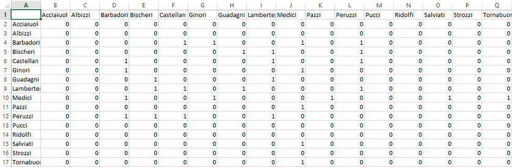
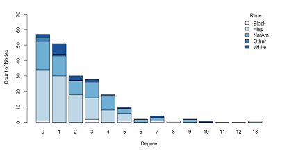

## Introducing statnetWeb

statnetWeb is a prototype web interactive interface for social network analysis. The functionality is based on the **ergm** package, a member of the statnet network analysis software suite, and also incorporates functionality from the associated packages **network** and **sna**.

To learn more about statnet, see the [statnet Wiki](https://statnet.csde.washington.edu/trac), where you can find publications, tutorials and recent news.

These slides are meant to serve as an interactive manual for the functionality of statnetWeb and as a guide to using the app as a teaching tool for introductory network analysis.

## Introduction to Network Analysis

In the network depiction of a community, nodes represent individual entities (people, organizations, etc.), which may be connected to each other by edges, based on the entities' relationship. For example, the following network shows the business connections among Florentine families (Padgett).

By analyzing a network, we can gain insight to the underlying structure of the network and how that structure influences the individual actors and relationships in the network.

```{r, echo=FALSE}
img(src="images/flobusiness_plot.png")
```


## Creating Networks

Outside of statnetWeb, the nodes and edges of a network can be denoted by adjacency matrices, incidence matrices or edge lists. Below is the adjacency matrix from the Florentine business network.



## statnetWeb: Data Upload

Observed network data can be uploaded to statnetWeb in various formats. From the Upload Network tab, the user can transfer files saved in Excel, R or Pajek into statnetWeb for further analysis. 

Alternatively, the user can choose from pre-loaded sample networks to experiment with while becoming familiar with statnetWeb.

```{r, echo=FALSE}
wellPanel(
fluidRow(
 column(6,
        radioButtons('filetype',label='File type',
                     choices=c('pre-loaded sample network'=5, 
                               'statnet network object (R-object)'=1,
                               'Pajek network (*.net)'=2,
                               'Pajek project (*.paj)'=3,
                               'matrix of relational data (*.csv or R-object)'=4))
                              ),
 conditionalPanel(condition = 'input.filetype < 5',
   column(6,
        br(),
        fileInput(inputId='rawdatafile', label=NULL, accept='text'),
        verbatimTextOutput('rawdatafile'))
    ),
 conditionalPanel(condition = 'input.filetype == 5',
        br(),
        selectInput('samplenet', label='Choose a network',
                    choices=c('None', 'ecoli1', 'ecoli2',
                              'faux.mesa.high','flobusiness',
                              'flomarriage', 'kapferer', 'kapferer2',
                              'molecule', 'samplike'),
                    selectize=FALSE) 
                  )
 ),
   fluidRow(
     conditionalPanel(condition='input.filetype == 4',
         p('Specify', style="font-size:12pt; color:black;"),
         column(4,
                radioButtons('matrixtype', label='Matrix Type',
                             choices=c('Adjacency matrix'='adjacency', 
                                       'Bipartite adjacency matrix'='bipartite',
                                       'Incidence matrix' = 'incidence',
                                       'Edge list' = 'edgelist'))),
         column(5,
                span('Network Attributes', style="font-size:12pt;color:black;"),
                div(checkboxInput('dir', 'directed?', value=TRUE),
                     style='padding-top:5px;'),
                checkboxInput('loops', 'loops?', value=FALSE),
                checkboxInput('multiple', 'multiple?', value=FALSE),
                checkboxInput('bipartite', 'bipartite?', value=FALSE))
                ),
 conditionalPanel(condition='input.filetype == 3',
     p('Specify', style="font-size:12pt; color:black;"),
     column(6,
            selectInput('choosepajnw', label='Upload a Pajek project file and choose a network from it',
choices = c('None'), selectize=FALSE)))
))
```

## statnetWeb: Data Upload

<ul>
<li>**Excel:** 
  <ul>
  <li>Specify the type of matrix and upload a .csv file of relational data. </li>
  <li>Adjacency matrices should have vertex labels in the first row and column.</li>
  <li>Incidence matrices should have edge labels in the first row and vertex labels in the first column.</li>
  <li>Edge lists should not have row or column labels.</li>
  </ul>
</li>
<li>**R:** 
  <ul>
  <li>Upload a matrix of relational data or a statnet network object. </li>
  <li>Objects should be exported from R using the command `save(objectname, file="newfilename"  )`.  
  By default the file will be saved into the current working directory, but the full path to a new location can be specified in the `file=` argument, or set `file=file.choose(new=TRUE)` to use a save dialog box.</li>
  </ul>
</li>
<li>**Pajek:** 
  <ul>
  <li>Upload network or project files (.net or .paj, respectively). </li>
  </ul>
</li>
</ul>

## statnetWeb: Network Descriptives

Network descriptives are valuable for gaining insight into the observed network. Exploring plots and descriptive statistics before fitting a model can lead to better model formulations and improve interpretation of results.

```{r, echo=FALSE}
suppressPackageStartupMessages(require(ergm, warn.conflicts=FALSE,quietly=TRUE))
data("faux.mesa.high")
sidebarLayout(position="right",
sidebarPanel(width=3,
  checkboxInput("iso", label="Display isolates", value=T),
  checkboxInput("vnames", label="Display vertex names", value=F),
  sliderInput("opacity", label="Vertex opacity", min=0, max=1, value=1),
  selectInput("vcol", label="Color nodes according to:",
              choices=c("None", "Grade", "Race", "Sex"),
              selectize=FALSE),
  selectInput("vsize", label="Size nodes according to:",
              choices=c("None", "Betweenness", "Grade"),
              selectize=FALSE)
  ),
mainPanel(
  renderPlot({
    par(mar=c(0,0,0,0))
    plot(faux.mesa.high, displaylabels=input$vnames,
         displayisolates=input$iso)
  })
  )
)
```

## statnetWeb: Network Descriptives

<div class="columns-2">

Degree distribution:  



Geodesic distribution:  

</div>

## statnetWeb: Fit Model

Our goal is to use key model statistics to fit an exponential-family random graph model (ERGM) to the observed data. We want this model to capture the underlying structure of the network.  

What is an ERGM?  

* Exponential-family random graph models: a class of models for specifying the probability distribution for a set of random graphs or networks.  
$$ P(Y=y)=\frac{exp(\theta)}{k(\theta)} $$

## statnetWeb: MCMC Diagnostics

## statnetWeb: Goodness-of-fit

## statnetWeb: Simulations
