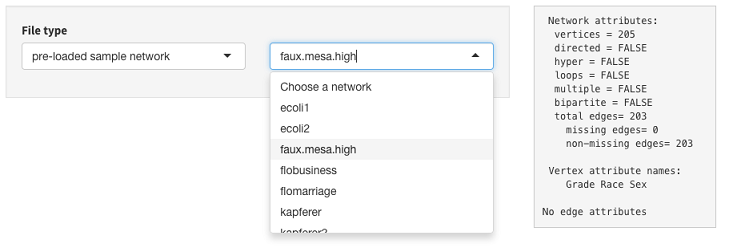
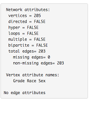
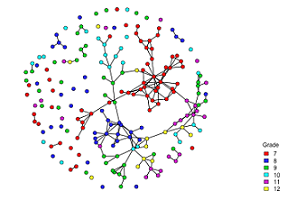

# Introduction to statnetWeb

statnetWeb is a prototype web interactive application for social network analysis. Users can perform complete analyses of relational data (including network visualization, model estimation and evaluation, and model-based simulation) through the user-friendly interface and can download results and figures throughout the process. 

This document is meant to serve as a guide to using statnetWeb as a teaching tool for introductory network analysis courses. We provide templates for course outlines (both 10 and 14 week formats), which are not exhaustive of all course material and should be taylored according to students' backgrounds. Following the course templates is a summary of the programming involved in creating statnetWeb.

Suggestions for improvements and additional functionality to statnetWeb are welcome!

## Why These Tools?

Dichotomy in network analysis software: 
UCINET, PNet, Pajek, Siena vs. R

Learning how to program in R before accessing these powerful statistical analysis tools presents a large barrier to many people who are new to network analysis.

statnetWeb is built with [Shiny](http://shiny.rstudio.com/), a framework for creating web applications with content written in the R programming language. We see the app as a great tool for introducing the concepts and process of network analysis in a way that is less programming intensive. 

The functionality is based on the **ergm** package, a member of the statnet network analysis software suite, and also incorporates the associated packages **network** and **sna**. For in depth analysis, researchers would want to transition into accessing the full functionality of statnet through the command line. 

To learn more about statnet, see the [statnet Wiki](https://statnet.csde.washington.edu/trac), where you can find publications, tutorials and recent news.

## Course Outline

10 Week Course:

* Network analysis basics: 2 weeks
* Data: 1 week
* Network descriptives: 1 week
* Model estimation: 2 weeks
* Diagnostics: 1 week
* Model-based simulation: 2 weeks
* Review and further topics: 1 week

# Course Material

## Basic Components of Network Analysis

Week 1 Learning objectives:

**What is a network?** A population of nodes with links.
<ul>
<li>*Nodes:* aka vertices, actors</li>
  <ul>
  <li>Represent individual entities (people, organizations, etc.), which may be connected to each other by *links*.</li>
  <li>Nodes can have associated categorical or quantitative attributes (age, sex, etc.).</li>
  </ul>
<li>*Links:* aka edges, ties</li>
  <ul>
  <li>Can be directed/undirected and valued/binary</li>
  </ul>
<li>Types of networks: bipartite, valued, directed, etc.</li>
  <ul>
  <li>Defined by properties of the nodes and links</li>
  </ul>
</ul>

**Motivation**  
What can we accomplish with network analysis?  
<ul>
<li>Examples</li>
<li>Glimpse ahead to types of analysis</li>
</ul>

**Network data storage and representation**
<ul>
<li>Overview of adjacency matrices, incidence matrices, edge lists</li>
<li>Intro to idea of missing data</li>
  <ul>
  <li>Missing edge $\not\Rightarrow$ no edge
  </ul>
</ul>
**Network data as a graph**
<ul>
<li>Graph notation</li>
<li>Graph terminology</li>
</ul>

Week 2 Learning objectives:

**Network data sampling designs**
<ul>
<li>Census:  data on every node and link in the population of interest</li>
<li>Adaptive sample:  link-tracing designs, e.g., snowballs, Respondent Driven Sampling, etc.</li>
<li>Egocentric sample: a sample of nodes (egos) with data on their links to other nodes (alters).  The alters may or may not be identifiable, and may or may not be in the sample, and data may or may not exist on ties between the alters (as reported by ego).</li>
</ul>
**Types of network analysis**
<ul>
<li>Descriptive</li>
  <ul>
  <li>A set of summary statistics calculated on the network</li>
  <ul>
  <li>E.g., density, degree distribution, centrality, etc.</li>
  </ul>
  </ul>
<li>Statistical</li>
  <ul>
  <li>A model representing the factors that determine the probability of a link between two nodes, with parameters that can be estimated from network data.  {NEED TO DEVELOP A TYPOLOGY HERE – CHECK SNIJDERS?}</li>
  <li>Models for links, nodal attributes fixed:</li>
  <ul>
  <li>In simple random graphs, each edge between two nodes is equally likely</li>
  <ul>
  <li>Not the case for most social networks</li>
  <li>The chance of a tie between nodes i and j may depend on the attributes of i and j</li>
  </ul>
  <li>By analyzing a social network, we can gain insight to the underlying structure of the network and how that structure influences the individual actors and relationships in the network</li>
  <li>Then, we can predict the formation and structure of other networks</li>
  </ul>
  <li>Joint models for nodal attributes and links:  Influence and Selection</li>
  </ul>
</ul>

## Network Data

Week 3 Learning objectives:

Outside of statnetWeb, the nodes and edges of a network can be denoted by adjacency matrices, incidence matrices or edge lists. Below is the adjacency matrix from the Florentine business network.

### statnetWeb: Data

Observed network data can be uploaded to statnetWeb in various formats. From the Upload Network tab, the user can transfer files saved in Excel, R or Pajek into statnetWeb for further analysis.  

<ul>
<li>**Excel:** </li>
  <ul>
  <li>Specify the type of matrix and upload a .csv file of relational data. </li>
  <li>Adjacency matrices should have vertex labels in the first row and column.</li>
  <li>Incidence matrices should have edge labels in the first row and vertex labels in the first column.</li>
  <li>Edge lists should not have row or column labels.</li>
  </ul>
<li>**R:** </li>
  <ul>
  <li>Upload a matrix of relational data or a statnet network object. </li>
  <li>Objects should be exported from R using the command `save(objectname, file="newfilename"  )`.  
  By default the file will be saved into the current working directory, but the full path to a new location can be specified in the `file=` argument, or set `file=file.choose(new=TRUE)` to use a save dialog box.</li>
  </ul>
<li>**Pajek:** </li>
  <ul>
  <li>Upload network or project files (.net or .paj, respectively). </li>
  </ul>
</ul>  

Alternatively, the user can choose from pre-loaded sample networks to experiment with while becoming familiar with statnetWeb.
 

Once a network has been uploaded, a summary of the network's properties will be displayed on the right side of the page.

## Network Descriptives

Week 4 Learning objectives:

Network descriptives are valuable for gaining insight into the observed network. Exploring plots and descriptive statistics before fitting a model can lead to better model formulations and improve interpretation of results.  

### statnetWeb: Network Descriptives

**Network Plot**  
Looking at a network plot can give a general sense of the network, and editing the display options is even more revealing. When the nodes of the faux.mesa.high network are color-coded, it is easy to see clustering by grade. Likewise, sizing the nodes of the flomarriage by wealth shows a tendency for wealthier families to have more marriage ties.  
In statnetWeb, any nodal attributes will be available in the color-coding menu. Numeric attributes, plus the betweenness measures of the nodes will be available in the sizing menu.  
   

**Degree Distribution**  
Inspect the distribution of nodal degrees throughout the network. Do most nodes have similar degree? Are there a few nodes with high degree ("hubs") and many with low degree? Does the distribution vary by attribute?

**Geodesic Distribution**  
The geodesic measures the length of the shortest path between two nodes. A geodesic distance of "inf" between two nodes means that they are not connected by any path. Compare the distribution of the geodesics from all the dyads in the observed network to null models.
<ul>
<li>Conditional uniform graphs (CUG): Draws from the distribution of simple random graphs with the same fixed density as the observed network.</li>
<li>Bernoulli random graphs (BRG): Draws from the distribution of simple random graphs with the same stochastic tie probability as the observed network.</li>
</ul>
When compared to the null models, the faux.mesa.high network has fewer paths of length 5-8 than we would expect, and more disconnected node pairs (with geodesic distance inf).  

**More node- and graph-level indices**

## Model Estimation

Weeks 5-6 Learning objectives:

Our goal is to use key model statistics to fit an exponential-family random graph model (ERGM) to the observed data. We want this model to capture the underlying structure of the network, so we include statistics that we hypothesize differ significantly in the observed network when compared to a simple random graph.
* examples of model statisitics

<u>Important to consider:</u> model statistics are either dyad dependent or dyad independent.

**What is an ERGM?**  
Exponential-family random graph models are a class of models for specifying the probability distribution for a set of random graphs or networks.
$$ P(Y=y)=\frac{exp(\theta)}{k(\theta)} $$
<ul>
<li> $Y$: random variable for state of network (with realization $y$)
<li> $g(y)$: vector of model statistics for network $y$
<li> $\theta$: vector of coefficients for statistics $g(y)$
<li> $k(\theta)$: numerator summed over all possible networks (with same node set as $y$)
</ul>

Conditional log-odds: $\mathrm{logit}(Y_{ij} = 1|y_{ij}^{c}) = \theta'\delta(y_{ij})$
<ul>
<li>$\delta(y_{ij})$ is the change statistic, i.e. it records how $g(y)$ changes if the tie $y_{ij}$ is toggled on or off</li>
<li>$\theta$ (the coefficient for a model statistic) is the log-odds of an individual tie conditional on all others</li>
</ul>

### statnetWeb: Fit Model

We can choose which model statistics to include in an ERGM. In statnetWeb, each model statistic that we want to include is represented by a term in the model formula. There are many terms coded into the statnet software and the term documentation window gives access to the help file of each one.

How does statnetWeb find a model that fits?  
<ul>
<li>MLE: maximum likelihood estimation</li>
<li>MCMC: only for models with dyadic dependent terms</li>
</ul>

Output from model fitting
<ul>
<li>Iterations - useful to see if model is degenerate</li>
<li>Model summary</li>
  <ul>
  <li>Interpretation of coefficient estimates:</li>
  <ul>
  <li>Conditional log-odds of two actors having a tie is  
  $\theta_1$ x change in stat1 + $\theta_2$ x change in stat2
  <li>Corresponding probability from equation above
  </ul>
  </ul>
  <li>Save up to five models for comparison  
  
  <li>When a model fails
  <ul>
  <li>Control parameters: burn-in, interval, sample size
  <li>If the user is familiar with more MCMC control parameters, they can be entered in the text box.
  </ul>
</ul>

Example: -Inf coefficients

## Model Evaluation

Week 7 Learning objectives:

### statnetWeb: MCMC Diagnostics

We want the MCMC sample statistics to vary randomly around the observed values and the difference between the observed and simulated values of the sample statistics to have a roughly bell-shaped distribution, centered at 0.  
<ul>
<li>flobusiness ~ edges+degree(1)  

</ul>
Interpreting other MCMC diagnostics  
<ul>
<li>flobusiness ~ edges+degree(0)  
flobusiness has 5 isolates, can't have any fewer than -5 from target statistic  

</ul>

### statnetWeb: Goodness-of-fit

Test how well your model fits the original data by choosing a network statistic that is not in the model, and comparing the value of this statistic observed in the original network to the distribution of values you get in simulated networks from your model.  
When multiple models are saved, compare GOF plots in a chart.

## Model-Based Simulation

Weeks 8-9 Learning objectives:

After creating an ergm and checking the diagnostics, we can simulate from it (take examples of networks drawn from this distribution). If the model is a good fit to the observed data, then networks drawn from this distribution will be more likely to “resemble” the observed data.

### statnetWeb: Simulate

<ul>
<li>View network plot of each simulation; edit display options in the same way as the plot of the observed network.
<li>View plot of simulation statistics compared to the target statistics
[IMAGE OF AUTOCORRELATED STATISTICS]
<li>Edit MCMC controls (e.g. increase the interval if simulation statistics are highly auto-correlated.)
[IMAGE AFTER INCREASING INTERVAL]
<li>Download simulation statistics
</ul>

## Review and Further Topics

Week 10 Learning objectives:

# Shiny

  
 
