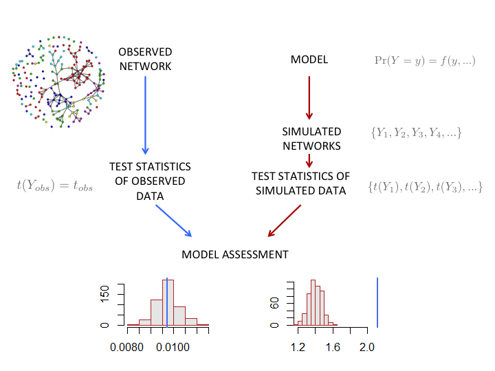
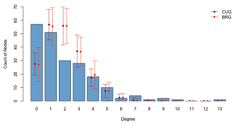
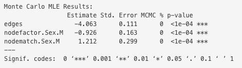
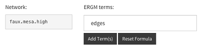
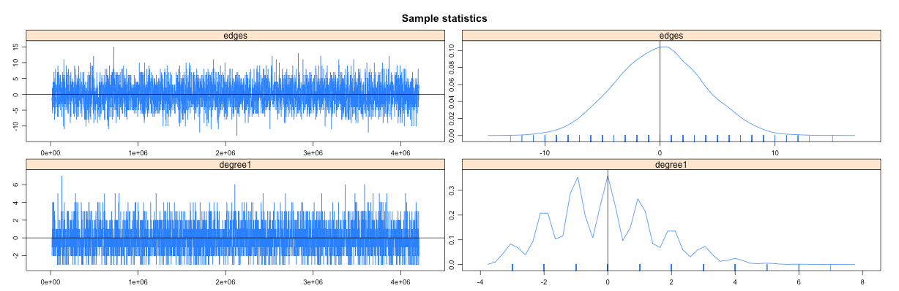

# Introduction to statnetWeb

statnetWeb is a prototype web interactive application for social network analysis. Users can perform complete analyses of relational data (including network visualization, model estimation and evaluation, and model-based simulation) through the user-friendly interface and can download results and figures throughout the process. 

This document is meant to serve as a guide to using statnetWeb as a teaching tool for introductory network analysis courses. Below we provide a course outline template with references to in-depth resources for certain topics. Following the course template is a brief summary of the programming involved in creating statnetWeb.

Suggestions for improvements and additional functionality to statnetWeb are welcome!

## Why These Tools?

Network analysis techniques have progressed immensely over the past 60 years and continue to develop quickly. 
<ul>
<li> Graph theoretic summaries
  <ul>
  <li>Degree distribution, geodesics, centrality measures, etc.
  <li>No inference
  </ul>
<li> Conditionally uniform models (Holland and Leinhardt 1976, Wasserman 1977)
  <ul>
  <li>Useful as null hypotheses, but don't give indications of how to model
  </ul>
<li> $p_1$ model ([Holland and Leinhardt 1981](http://www.stat.cmu.edu/~fienberg/Stat36-835/HollandLeinhardt-JASA-1981.pdf))
  <ul>
  <li>Statistical inference
  <li>Large number of parameters
  </ul>
<li> Markov model
  <ul>
  <li>Dyad dependence
  </ul>
<li> ERGMs
</ul>


As the field grows, software programs geared toward various types of network analysis (above) are created. A dichotomy has emerged between those accessed with a graphical user interface and those accessed through the command line. Although GUI-based programs are easier for a wide range of people to interact with, the analysis possibilities are limited to the specific options provided in the interface. On the other hand, command line interfaces allow the user much more flexibility, but require a significant initial investment to learn the syntax of a programming language.

The [statnet](https://statnet.csde.washington.edu/trac) project encompasses a suite of packages in the R programming language and provides a comprehensive framework for statistical network modeling based on exponential family random graph models. 
Learning how to program in R before accessing these powerful statistical analysis tools presents a large barrier to many people who are new to network analysis, so we created statnetWeb in order to reduce the upfront obstacles.

The functionality of statnetWeb is based on the **ergm** package, a member of the statnet software suite, and also incorporates the associated packages **network** and **sna**. The app occupies a middle ground in the spectrum of software accessibility and we see it as a valuable tool for teaching and understanding the concepts and process of network analysis in a context less dependent on programming expertise. For in depth analysis, researchers can transition into accessing the full functionality of statnet through the command line. 

statnetWeb is built with [Shiny](http://shiny.rstudio.com/), a framework for creating web applications with content written in R.  The app is available online at https://ebey.shinyapps.io/statnetWeb/ or can be run locally through RStudio. Development is on [GitHub](https://github.com/statnet/statnetWeb), where anyone can browse the code, make suggestions and report issues. 

To learn more about statnet, see the [statnet Wiki](https://statnet.csde.washington.edu/trac), where you can find publications, tutorials and recent news.

# Course Material

## Basic Components of Network Analysis

<font class="lobj">Learning objectives:</font> Know what a network is, what it can represent and why we use it. Gain a broad sense of network analysis uses and methods.

**What is a network?** A population of nodes with links.
<ul>
<li>*Nodes:* aka vertices, actors</li>
  <ul>
  <li>Represent individual entities (people, organizations, etc.), which may be connected to each other by *links*.</li>
  <li>Nodes can have associated categorical or quantitative attributes (age, sex, etc.).</li>
  </ul>
<li>*Links:* aka edges, ties</li>
  <ul>
  <li>Can be directed/undirected and valued/binary</li>
  </ul>
<li>Types of networks: bipartite, valued, directed, etc.</li>
  <ul>
  <li>Defined by properties of the nodes and links</li>
  </ul>
</ul>


**Motivation**  
What can we accomplish with network analysis?  
<ul>
<li>Examples</li>
  <ul>
  <li>Show examples with statnetWeb</li>
  </ul>
<li>Glimpse ahead to types of analysis</li>
</ul>

**Network data storage and representation**
<ul>
<li>Overview of adjacency matrices, incidence matrices, edge lists</li>
</ul>
**Network data as a graph**
<ul>
<li>Graph notation</li>
<li>Graph terminology</li>
</ul>

**Network data sampling designs**
<ul>
<li>Census: data on every node and link in the population of interest</li>
<li>Adaptive sample: link-tracing designs, e.g., snowballs, respondent-driven sampling, etc.</li>
<li>Egocentric sample: a sample of nodes (egos) with data on their links to other nodes (alters).  The alters may or may not be identifiable, and may or may not be in the sample, and data may or may not exist on ties between the alters (as reported by ego).</li>
</ul>
**Types of statistical network analysis**  
See @snijders2011 
<ul>
<li>Descriptive</li>
  <ul>
  <li>A set of summary statistics calculated on the network</li>
  <ul>
  <li>E.g., density, degree distribution, centrality, etc.</li>
  </ul>
  </ul>
<li>Statistical</li>
  <ul>
  <li>If the researcher can capture the underlying structural features of a network with a few parameters, they can gain insight to how that structure influences the individual actors and relationships in the network and predict the structure of other networks.
  <li>The researcher creates a model, assumes that the observed network is the outcome of a random draw from that model.
  <ul>
  <li>A model represents the factors that determine the probability of a link between two nodes, with parameters that can be estimated from network data.</li>
  </ul>
  <li>Models for links, nodal attributes fixed:</li>
  <ul>
  <li>In simple random graphs, each edge between two nodes is equally likely - not the case for most social networks</li>
  <ul>
  <li>The chance of a tie between nodes i and j may depend on the attributes of i and j (e.g. Homophily)</li>
  </ul>
  </ul>
  <li>Joint models for nodal attributes and links:  Influence and Selection</li>
  <ul>
  <li>Transitivity
  </ul>
  </ul>
</ul>

<font class="ex">Exercise:</font> Read introductory chapters of a social network analysis textbook. Read published network analysis paper and identify type of analysis and why it was used.

## Network Data

<font class="lobj">Learning objectives:</font> Know differences between network representation methods and advantages/disadvantages of each. Practice creating networks, translating between each representation and uploading to statnetWeb.

Outside of statnetWeb, the nodes and edges of a network can be denoted by adjacency matrices, incidence matrices or edge lists.


<ul>
<li>Limitations:
  <ul>
  <li>Adjacency matrices are large, but often sparse
  <li>Edge lists don't include isolates
  <li>
  </ul>
<li>The network type will be reflected in the data
</ul>


#### statnetWeb: Data

Observed network data can be uploaded to statnetWeb in various formats. From the Upload Network tab, the user can transfer files saved in Excel, R or Pajek into statnetWeb for further analysis.  


<ul>
<li>**Excel:** </li>
  <ul>
  <li>Specify the type of matrix and upload a .csv file of relational data. </li>
  <li>Adjacency matrices should have vertex labels in the first row and column.</li>
  <li>Incidence matrices should have edge labels in the first row and vertex labels in the first column.</li>
  <li>Edge lists should not have row or column labels.</li>
  </ul>
<li>**R:** </li>
  <ul>
  <li>Upload a matrix of relational data or a statnet network object. </li>
  <li>Objects should be exported from R using the command `save(objectname, file="newfilename"  )`.  
  By default the file will be saved into the current working directory, but the full path to a new location can be specified in the `file=` argument, or set `file=file.choose(new=TRUE)` to use a save dialog box.</li>
  </ul>
<li>**Pajek:** </li>
  <ul>
  <li>Upload network or project files (.net or .paj, respectively). </li>
  </ul>
</ul>  


Alternatively, the user can choose from pre-loaded sample networks to experiment with while becoming familiar with statnetWeb.

Once a network has been uploaded, a summary of the network's properties will be displayed on the right side of the page.

 

**Missing Data**
<ul>
<li>Missing edge $\not\Rightarrow$ no edge</li>
<li>statnet interprets NA entries not along the diagonal as missing
</ul>

<font class="ex">Exercise:</font> Practice creating networks, translating between each representation and uploading to statnetWeb.

## Network Descriptives

<font class="lobj">Learning objectives:</font>

Network descriptives are valuable for gaining insight into the observed network. Exploring plots and descriptive statistics before fitting a model can lead to better model formulations and improve interpretation of results.  


#### statnetWeb: Network Descriptives

**Network Plot**  
Looking at a network plot can give a general sense of the network, and editing the display options is even more revealing. When the nodes of the `faux.mesa.high` network are color-coded, it is easy to see clustering by grade. Likewise, sizing the nodes of the `flomarriage` by wealth reveals a tendency for wealthier families to have more marriage ties.

In statnetWeb, any nodal attributes are available in the color-coding menu. Numeric attributes, plus the betweenness measures of the nodes are available in the sizing menu.

 


**Degree Distribution**  
Inspect the distribution of nodal degrees throughout the network. Do most nodes have similar degree? Are there a few nodes with high degree ("hubs") and many with low degree? Does the distribution vary by attribute? 


**Geodesic Distribution**  
The geodesic measures the length of the shortest path between two nodes. A geodesic distance of "inf" between two nodes means that they are not connected by any path. Compare the distribution of the geodesics from all the dyads in the observed network to null models.

**More**
<ul>
<li>Mixing matrices</li>
<li>Node-level indices</li>
  <ul>
  <li>Degree, Betweenness, Closeness, Stress Centrality, Graph Centrality, Eigenvector Centrality, Information Centrality
  </ul>
<li>Graph-level indices</li>
  <ul>
  <li>Reciprocity, Transitivity, Density, Degree, Betweenness, Closeness, etc.
  </ul>
</ul>

## Statistical Models

<font class="lobj">Learning objectives:</font> Build understanding of modeling process and ERGMs step by step.

Recall, we want to capture the underlying structural features of a network with a few parameters. A statistical model for a network uses the chosen parameters as determining factors in specifying the probability of other possible networks. If we have a good model, simulations from it will resemble our original network.

The appropriate model depends on the type of data. For now, we consider fully observed binary networks.



Exponential-family random graph models (ERGMs for short) are a class of models for specifying the probability distribution for a set of random graphs or networks. statnetWeb uses ERGMs as a powerful and flexible framework for fitting and simulating from network models. The formula for an ERGM is below.


$$ P(Y=y)=\frac{\mathrm{exp}(\theta'g(y))}{k(\theta)} $$
<ul>
<li> $Y$: random variable for state of network (with realization $y$)
<li> $g(y)$: vector of model statistics for network $y$
<li> $\theta$: vector of coefficients for statistics $g(y)$
<li> $k(\theta)$: numerator summed over all possible networks (with same node set as $y$)
</ul>

It is not necessary to understand the intricacies of the the ERGM formula yet, we will revisit it in more detail later. We are introducing ERGMs now so that we can periodically refer to them as we build knowledge of network modeling. Many simple models fit into this framework, even though they were developed far before the ERGM theory.

#### Conditionally uniform models
Conditionally uniform models are useful as null models for hypothesis testing - we can compare test statistics from the observed network to the distribution of these statistics under the null models. If the observed value of the test statistic is sufficiently different from the null distribution we can reject the hypothesis that the observed network was generated by the null model.

BRG($\rho$): Bernoulli random graphs (simple random graphs)
  <ul>
  <li>This is the simplest model. Given the same number of nodes $n$ as the observed network, the probability of each tie is a constant $\rho$.
  $$ \text{P}(y_{ij}) = \rho $$
  <li>Note that each tie is formed independently of the others. The probability of a network $Y$ from this model is just the product of the probabilities of the presence/absence of each tie.
  $$ \text{P}(Y) = \rho^s(1-\rho)^{n*(n-1)-s}$$
  <li>BRG($\rho$) is not a good model for most networks, but comparing test statistics from the model to the observed network will allow us to see in what ways they are different. Often the tests will allow us to reject the null hypothesis that ties are formed randomly with probability $\rho$.
  <li>Do we have to test every possible $\rho$ if we want to reject all bernoulli graphs? If we use a value $\hat\rho$ that maximizes the probability that our observed network $y$ came from the distribution BRG($\rho$) and can reject this model, then we can reject BRG($\rho$) for all $\rho$. It can be shown that the MLE $\hat\rho$ is equal to $\bar{y}$, the density of the observed network.
  <li>Draws from this model can be simulated with the following code:
```
rho <- mean(Yobs, na.rm=T)
Ysim <- matrix(0,nrow=nrow(Yobs),ncol=nrow(Yobs))
diag(Ysim) <- NA
Ysim[!is.na(Ysim)] <- rbinom(n*(n-1),size=1,prob=rho)
```
  <li>Fitting this model is the same as fitting an ergm with *density* as the only parameter.
  </ul>

CUG($s$): Graphs conditional on number of ties $s$ (Erdos-Reyni graphs)
  <ul>
  <li>Given the same number of nodes $n$ as the observed network, all possible networks with $s$ total ties are equally likely (have uniform probability).
  <li>CUG($s$) does not require that we estimate $\rho$, it always reproduces the density of the observed network. It often gives similar results to the BRG($\hat\rho$) model above. 
  <li>Fitting this model is the same as fitting an ergm with *edges* as the only parameter.
  </ul>
  <div class="ex">
  <font class="ex">Example:</font> Compare the observed density of the `faux.mesa.high` network to the distribution of densities obtained from BRG($\hat\rho$). Note that when testing the standard-deviation of degrees in the network, the null models have similar distributions, but both fail to recreate the level of heterogeneity seen in the observed network.
  <div align="center">  </div>
  Also see these distributions as overlays on the degree and geodesic distributions in **statnetWeb**.  
  When compared to the null models, the `faux.mesa.high` network has more isolated nodes than we would expect, fewer paths of length 5-8, and more disconnected node pairs (with geodesic distance inf).  
<div align="center"> </div>
  </div>

It is possible to add more conditions to make a more complicated CUG model: 
  <ul>
  <li>A null hypothesis where ties are independent of covariates, i.e. $p(Y,x)=p(Y) \times p(x)$, and the ties are drawn from the CUG($s$) distribution. We can simulate this by randomly reassigning the ties in $Y$ and holding the covariates $x$ constant.  
```
Ysim <- matrix(0,n,n)
diag(Ysim) <- NA
Ysim[!is.na(Ysim)] <- sample(Yobs[!is.na(Yobs)])
```
  <li>A null hypothesis where ties are independent of covariates and  the covariates are i.i.d. for some distribution $p(x)$. We can simulate this by holding the ties in $Y$ constant and randomly permuting the values in $x$.
```
Ysim <- Yobs
xsim <- sample(xobs)
```
  </ul>


  
#### Covariate effects, odds ratios for tie preferences
  <ul>
  <li>Rearrange the rows and columns of an adjacency matrix to create a blockmodel where nodes are grouped by values of a nodal covariate. Each block is a subgraph with its own density.
  <li>Comparing densities of the blocks shows potential effects from the covariate on tie formation.

  
  
  <li> The odds of an event $E$ occurring is the ratio of the probability that $E$ occurs to the probability that it doesn't.  
  $\text{odds}(E) = \frac{\text{Pr}(E)}{1-\text{Pr}(E)}$
  <li> An odds ratio compares the odds of $E$ occuring given $A$, to the odds of $E$ occuring given $B$, where $B=A^C$    
  $\text{odds}(E| A, B) = \frac{\text{Pr}(E|A)}{1-\text{Pr}(E|A)}\frac{1-\text{Pr}(E|B)}{\text{Pr}(E|B)}$
  <li> The relative rates $\frac{p_{01}}{p_{00}}, \frac{p_{10}}{p_{00}}$ capture the relative tendency of ties in heterogeneous pairs compared to the baseline rate $p_{00}$
  <li> The odds ratio $\frac{p_{00}p_{11}}{p_{01}p_{10}} = \gamma$ represents preference for homophily.
  <ul>
  <li> $\gamma = \text{odds ratio}(x_j=1 | \{y_{ij}=1,x_i=1\}\{y_{ij},x_i=0\})$
  <li> $\gamma = \text{odds ratio}(x_i=1 | \{y_{ij}=1,x_j=1\}\{y_{ij},x_j=0\})$
  </ul>
  <li> Together, the set $\{ p_{00}, \frac{p_{01}}{p_{00}}, \frac{p_{10}}{p_{00}}, \frac{p_{00}p_{11}}{p_{01}p_{10}}\}$ can give a better sense of the data than individual probabilities from each block.
  
  <div class="ex">
  <font class="ex">Example:</font> Ties between males/females in `faux.mesa.high` network. We can see from the probabilities of ties within and between the sexes (which are the densities of those subgraphs) that female-female ties are the most likely in this network. The relative rates show us that male-female relationships are less than half as likely as female-female and the odds ratio shows that there is a strong preference for within sex ties.  
  $$\begin{align*}
  p_{FF}&=0.017 \\
  p_{FM}=p_{MF}&= 0.007 \\
  p_{MM}&=0.009
  \end{align*}$$
   
  $$\begin{align*}
  p_{FF}&=0.017 \\
  \frac{p_{FM}}{p_{FF}}=\frac{p_{MF}}{p_{FF}}&=0.400 \\
  \frac{p_{FF}p_{MM}}{p_{FM}p_{MF}}&=3.318
  \end{align*}$$
  </div>
  </ul>
  
#### Logistic regression

**The logit function**

Recall that given a binary outcome variable $Y$ with probability of success $\Pr(Y=1)=p$, we can express the odds of a success. If we take the log of the odds we have what is sometimes referred to as the **logit**. 

$$\begin{align*}
\text{odds}(Y=1) &= \frac{p}{1-p} \\
\nu = \text{log odds}(Y=1) &= \log\left(\frac{p}{1-p}\right),  \hspace{1.5em} 0 < p < 1
\end{align*}$$

Solving for $p$ gives us the logistic function (also known as the expit).
Note that the logit function is the inverse of the logistic function.
$$
p = \frac{e^\nu}{1+e^\nu} \\
\text{logit}(p) = \log\left(\frac{p}{1-p}\right) = \log\left(\frac{e^\nu / (1+e^\nu)}{1/ (1+e^\nu)}\right) = \log(e^\nu) = \nu
$$

The logit also makes it convenient to write log odds ratios.
$$
\log\left(\frac{p_1/(1-p_1)}{p_2/(1-p_2)}\right) = \log\left(\frac{p_1}{1-p_1}\right) - \log\left(\frac{p_2}{1-p_2}\right) = \text{logit}(p_1) - \text{logit}(p_2)
$$

**Logistic regression as a GLM**

Logistic regression is a special case of **generalized linear models**. GLMs describe the relationship between explanatory variables $x$ and  the expected value of a response variable $\mu=E(Y)$ through a link function $g(.)$. The model takes the form 
$$g(\mu) = \beta_0 + \beta_1 x_1 + ... + \beta_k x_k.$$

The simplest link function is $g(\mu)=\mu$, which specifies a linear model for the mean response. The log link function $g(\mu)=\log(\mu)$ leads to a loglinear model, and is appropriate when $\mu$ cannot be negative, such as for count data. Logistic regression uses the link function $g(\mu)=\log[\mu/(1-\mu)]$, called the logit link, and models the log of an odds. It is appropriate when $\mu$ is between 0 and 1, such as for a probability.

Suppose the probability of success $p$ from above depends on explanatory variable(s) $x$, so that $\Pr(Y=1 | x)=p(x)$. The right side of the model is a linear combination of the explanatory variables: $\beta_0 + \beta_1 x_1 + ... \beta_k x_k$. Using the logit to link the linear predictor to the response gives us the following logistic regression model.
$$\begin{align*}
\text{logit}[p(x)] &= \log\left(\frac{p(x)}{1-p(x)}\right) = \beta_0 + \beta_1 x_1 \\
p(x) &= \frac{e^{\beta_0 + \beta_1 x_1 }}{1+e^{\beta_0 + \beta_1 x_1 }}
\end{align*}$$


See @agresti1996 for more on generalized linear models.

**Logistic regression for networks**

To apply this concept to network data, let $x_1$ and $x_2$ be covariates and $\Pr(y_{ij} = 1 | x_1, x_2)$ be the probability of a tie from node $i$ to $j$. Now we have
$$
\Pr(y_{ij} = 1 | x_1, x_2) = \frac{e^{\beta_0 + \beta_1 x_1 + \beta_2 x_2}}{1+e^{\beta_0 + \beta_1 x_1 + \beta_2 x_2}}
$$


Given differences between densities in the blockmodel ($\{p_{00}, p_{01}, p_{10}, p_{11}\}$ in the section above), perhaps we think that the values of a nodal attribute are primary factors in tie formation. We can use logistic regression to model the effect of a binary covariate on the likelihood of ties, assuming that ties form independently of each other. Here $x_1$ indicates the covariate value in each row, $x_2$ indicates the covariate value in each column, and $x_1x_2$ is their interaction.
  <ul>
$$\begin{align*}
 \Pr( y_{i,j} = 1 | x_i,x_j ) &= 
\frac{ e^{ \beta_0 + \beta_1 x_i + \beta_2 x_j +    \beta_{12} x_i x_j}    }
      {1+ e^{ \beta_0 + \beta_1 x_i + \beta_2 x_j +     \beta_{12} x_i x_j }  } \\ \\
\Pr( y_{i,j} = 0 | x_i,x_j ) &= 
\frac{1}{1+e^{\beta_0+\beta_1 x_i + \beta_2 x_j +  \beta_{12} x_i x_j } } \\ \\
\frac{\Pr( y_{i,j} = 1 | x_i,x_j )}{\Pr( y_{i,j} = 0 | x_i,x_j )} = \text{odds}( y_{i,j} = 1 | x_i,x_j ) &= 
  \exp( \beta_0+\beta_1 x_i + \beta_2 x_j +  \beta_{12} x_i x_j ) \\ \\
\text{logit}(y_{i,j} = 1 | x_i,x_j) = \text{log odds}( y_{i,j} = 1 | x_i,x_j ) &= 
  \beta_0+\beta_1 x_i + \beta_2 x_j +  \beta_{12} x_i x_j  
\end{align*}$$
  <li> $\beta_0$ is the baseline log odds of a tie in the case where $x_i = x_j = 0$
  <li> $\beta_1$ is the log of the odds ratio $(y=1|(1,0),(0,0))$, it represents the "effect" of $x_i$
  <li> $\beta_2$ is the log of the odds ratio $(y=1|(0,1),(0,0))$, it represents the "effect" of $x_j$
  <li> $\beta_{12}$ is the log of the ratio of odds ratios $(y=1|(1,1),(0,1))/(y=1|(1,0),(0,0))$, it represents the effect of the interaction $x_i x_j$
  <li>How are $\{\beta_0, \beta_1, \beta_2, \beta_{12}\}$ related to $\{p_{00}, \frac{p_{10}}{p_{00}}, \frac{p_{01}}{p_{00}}, \frac{p_{00}p_{11}}{p_{01}p_{10}}\}$?  
  <ul>
  If network density is low, $1-p_{x_ix_j} \approx 1$  
  $$o_{x_ix_j} = p_{x_ix_j}/(1-p_{x_ix_j}) \approx p_{x_ix_j}$$
  And
  $$\begin{align*}
  \{ p_{00}, \frac{p_{10}}{p_{00}}, \frac{p_{01}}{p_{00}}, \frac{p_{00}p_{11}}{p_{01}p_{10}}\} & \approx \{o_{00}, \frac{o_{10}}{o_{00}}, \frac{o_{01}}{o_{00}}, \frac{o_{00}o_{11}}{o_{01}o_{10}}\} \\
  & = \{\text{e}^{\beta_0}, \text{e}^{\beta_1}, \text{e}^{\beta_2}, \text{e}^{\beta_{12}}\}
  \end{align*}$$
  </ul>
  
  <div class="ex">
  <font class="ex">Example:</font> Fit the above model to the `faux.mesa.high` network using the "Sex" attribute as a covariate. We can do this in multiple ways:
  
<ul>
<li>Using vectors in R, where `xr` is the binary covariate indicating sex in each row, and `xc` is the same for the columns:  
`glm(y ~ xr + xc + xr*xc, family=binomial)`
<li>Using the ergm package:   
`ergm(faux.mesa.high ~ edges + nodefactor("Sex") + nodematch("Sex",diff=TRUE,keep=2))`
<li>In statnetWeb:   
<div align="center"> </div>
</ul>  
  
  Results:  
  
  <div align="center"></div>
  
  Compare the odds ratios (the result of exponentiating the $\beta$ coefficients) to the relative rates above. 
  $$\begin{align*}
  \text{exp}(\beta_0) &= 0.017 \\
  \text{exp}(\beta_1) = \text{exp}(\beta_2) &= 0.396 \\
  \text{exp}(\beta_{12}) &= 3.360
  \end{align*}$$
  
  Simulate networks from this model and evaluate the fit based on test statistics:  
  <div align="center"></div>
  
  </div>
  </ul>
So far we have been assessing the fit of our models by generating histograms of test statistics that we compute from simulations from the model...


If we don't include any covariates in a logistic regression, we have the simple case where $\Pr(y_{ij}=1) = \frac{\text{exp}(\beta_0)}{1+\text{exp}(\beta_0)}$. This corresponds to the bernoulli model, where every edge is equally likely.
<ul>
  <div class="ex">
  <font class="ex">Example:</font> We can fit the bernoulli model in R with the GLM function:
```
brg.fit <- glm(c(Yfmh) ~ 1, family=binomial)
summary(brg.fit)
```

Or with the ergm package:
```
brg.fit2 <- ergm(faux.mesa.high ~ edges)
```

Or with statnetWeb:  
<div align="center"> </div>

And with each we get the same result.  


  The fit summary tells us that the estimate of $\beta_0$ is -4.63. This should be the log odds of any edge in the `faux.mesa.high` network. Let's double check:  
  $$\begin{align*}
  p &= \frac{s}{n(n-1)/2} = \frac{203}{205*204/2} \\
  \text{odds} &= \frac{p}{1-p} \\
  \text{log odds} &= \log [\frac{p}{1-p}] = -4.63
  \end{align*}$$
  
  
  </div>
</ul>

Why were we able to use the ergm software to fit the models above? Because logistic regression models are ERGMs! We will make this connection more explicit later, but for now reading the help documentation for each term used above (through the documentation box in statnetWeb or `help("ergm-terms")` in the command line) should present some connections to the logistic regression formula.
  
#### Individual effects

Perhaps some nodes in a directed network are more likely to send ties (more sociable) or more likely to receive ties (more popular). We can capture the variability of out-degree and in-degree by fitting the marginal totals of a network's adjacency matrix.
<div align="center">

</div>

For each node $i$ in a network, let $a_i$ be an effect on $i$'s propensity to send ties and let $b_i$ be an effect on $i$'s propensity to receive ties. The vectors $\vec{a}$ and $\vec{b}$ are called row and column effects, respectively. In a friendship network, $a_i$ can be interpreted as a measure of sociability of node $i$, and $b_j$ can be interpreted as a measure of popularity of node $j$. Note that in an undirected network the row and column sums are equal, so $a_i = b_i$ for each node $i$. Depending on our data, we might want to include either row or column effects in our model. The model below takes into account both row and column effects.

  
  $$\text{Pr}(Y_{ij}=1)=\frac{\text{e}^{\mu + a_{i} + b_{j}}}{1+\text{e}^{\mu + a_{i} + b_{j}}}$$   
  
  However, there are multiple sets of coefficients that will give the same fit. We should enforce side conditions on $a_i$ and $b_j$ so that we know how to interpret the coefficients.
  $$\frac{\text{e}^{\mu + a_{i} + b_{j}}}{1+\text{e}^{\mu + a_{i} + b_{j}}} = \frac{\text{e}^{\tilde\mu + \tilde a_{i} + \tilde b_{j}}}{1+\text{e}^{\tilde\mu + \tilde a_{i} + \tilde b_{j}}}$$
  
  <div style="position:relative; left:50px;">
  <u>Sum to zero side conditions:</u> $\sum a_i = 0, \sum b_j = 0$  
  
  $\mu$: overall mean  
  $a_i$: average deviation of row $i$ from $\mu$  
  $b_j$: average deviation of column $j$ from $\mu$
  
  
  <div style="position:absolute; left:400px; bottom:0px;">
  <u>Set to zero side conditions:</u> $a_1 = b_1 = 0$
  
  $\mu$:  
  $a_i$: average deviation of row $i$ from row 1  
  $b_j$: average deviation of column $j$ from column 1  
  </div>
  </div>
  
  <ul>
  <div class="ex">
  <font class="ex">Example:</font> Consider the `sampson` data, a directed network of friendship nominations among a group of monks. Clearly our previous null models do not accurately capture the heterogeneity of in- and out-degree or the level of reciprocity.  
  <div align="center">  </div>  
  
  **RCE model:** 
  
  In the model, $a_i$ and $b_j$ explicitly account for each node's tendency to have lower or higher than average row and column sums, so we would expect a very good fit for the variability of out- and in-degree. We do not see any improvement in the fit of the number of reciprocated dyads, but as expected, the fit of in-degree variability is much better compared to the null models. Why is the observed heterogeneity in out-degree still lower than expected even after include row effects in our model? 
  
  <div align="center"> </div>  
  
  In the study design monks were asked on three separate occasions to list their three best friends; there is a tie from node $i$ to $j$ in this network if monk $i$ ever listed monk $j$ as one of his best friends.  This design significantly constrains the out-degree heterogeneity. In our bernoulli model above, all ties form with the same probability $\text{Pr}(Y=1)=\frac{\text{e}^{\mu}}{1+\text{e}^{\mu}}$ and this results in some level of hetergeneity in out-degrees. Introducing $a_i$ coefficients specific to each node can only increase the out-degree heterogeneity, so our model cannot match the observed variability in out-degrees unless we also introduce constraints. 

Fitting and simulating from this model in R is accomplished in the following way (using set to zero side conditions).  
```
Ysamp <- as.matrix(samplike)
diag(Ysamp) <- NA
Ridx <- matrix(1:n,n,n)
Cidx <- t(Ridx)
rce.fit <- glm(c(Ysamp) ~ factor(c(Ridx))+factor(c(Cidx)), family=binomial)
summary(rce.fit)
P.rce <- rce.fit$fitted.values

Ysim <- matrix(0,ns,ns)
diag(Ysim)<- NA
Ysim[!is.na(Ysim)] <- rbinom(ns*(ns-1),1,P.rce)
```
With the ergm package this becomes:
```
ergm.rce <- ergm(samplike ~ edges + sender + receiver)
sim1 <- simulate(ergm.rce, nsim=1)
```
And in statnetWeb it is even easier:  
<div align="center"></div>

<div align="center"></div>
  </div>
  </ul>
  


#### p<sub>1</sub> model
Above we saw that in the `sampson` data the number of mutual dyads was larger than expected under the RCE model. This would indicate within-dyad dependence in the data, whereas our models so far have assumed that each tie is independent of all other ties.
$$M = \sum_{i<j}y_{ij}y_{ji}$$
How to test for mutuality?
<ul>
<li>Compare observed $M$ to its distribution under some null model.
<li>Compare observed $M$ to its expected value under some simple conditions.
  <ul>
  <li>Fixed choice: Each individual makes exactly $d$ nominations uniformly at random.  
  $$\begin{align*} 
  E[M|H] &= E[\sum_{i<j} y_{ij}y_{ji} | H] \\
         &= \sum_{i<j} E[y_{ij}y_{ji} | H] \\
         &= {n \choose 2} E[y_{ij}y_{ji} | H] \\
         &= {n \choose 2} \text{Pr}(y_{ij}=1 \text{ and } y_{ji}=1 |H) \\
         &= {n \choose 2} \frac{d^2}{(n-1)^2}
  \end{align*}$$
  <li>Free choice: Individual $i$ makes exactly $d_i$ nominations uniformly at random  (controls for out-degree heterogeneity).
  $$\begin{align*} 
  E[M|H] = \frac{y_{\cdot\cdot}^2 - \sum y_{i \cdot}^2}{2(n-1)^2}
  \end{align*}$$  
  Where $y_{\cdot \cdot}$ is the total number of ties and $y_{i \cdot}$ are the column sums
  </ul>
</ul>

The $p_1$ model:
<ul>
<li> Between dyad relations are independent of each other
<li> Within dyad relations are dependent
</ul>
$$
\text{Pr}(y_{ij},y_{ji} | \mu, a_i, b_j, \gamma)
$$

Problems with the $p_1$ model
* Not generalizable
* Not parsimonious (many parameters!)

#### p<sub>2</sub> model

#### Markov graphs

#### Exponential random graph models (p$^*$)  


**What is an ERGM?**  
Exponential-family random graph models are a class of models for specifying the probability distribution for a set of random graphs or networks.

**ERG Model Specification**  
$$ P(Y=y)=\frac{\mathrm{exp}(\theta'g(y))}{k(\theta)} $$
<ul>
<li> $Y$: random variable for state of network (with realization $y$)
<li> $g(y)$: vector of model statistics for network $y$
<li> $\theta$: vector of coefficients for statistics $g(y)$
<li> $k(\theta)$: numerator summed over all possible networks (with same node set as $y$)
</ul>

Conditional log-odds: $\mathrm{logit}(Y_{ij} = 1|y_{ij}^{c}) = \theta'\delta(y_{ij})$
<ul>
<li>$\delta(y_{ij})$ is the change statistic, i.e. it records how $g(y)$ changes if the tie $y_{ij}$ is toggled on or off</li>
<li>$\theta$ (the coefficient for a model statistic) is the log-odds of an individual tie conditional on all others</li>
</ul>

Our goal is to use key model statistics to fit an exponential-family random graph model (ERGM) to the observed data. We want this model to capture the underlying structure of the network, so we include statistics that we hypothesize differ significantly in the observed network when compared to a simple random graph.  

<u>Important to consider:</u> model statistics are either dyad dependent or dyad independent.

* edges
* triangles
* nodes of degree 0
* nodal homophily (nodematch)

<font class="ex">Exercise:</font> Which of the above terms are dyad dependent? Why?

##### ERGM Estimation

#### statnetWeb: Fit Model

We can choose which model statistics to include in an ERGM. In statnetWeb, each model statistic that we want to include is represented by a term in the model formula. There are many terms coded into the statnet software and the term documentation window in statnetWeb gives access to the help file of each one.
<ul>
<li>Browse through all terms or narrow the results down to only the terms that are applicable to the currently loaded network.
<li>Commonly used terms: [click here](statnet.csde.washington.edu/EpiModel/nme/2014/d2-ergmterms.html)
</ul>

How does statnetWeb find a model that fits?  
<ul>
<li>MLE: maximum likelihood estimation</li>
<li>MCMC: only for models with dyadic dependent terms</li>
</ul>

Output from model fitting
<ul>
<li>Iterations - useful to see if model is degenerate</li>
<li>Model summary</li>
  <ul>
  <li>Interpretation of coefficient estimates:</li>
  <ul>
  <li>Conditional log-odds of two actors having a tie is  
  $\theta_1$ x change in stat1 + $\theta_2$ x change in stat2
  <li>Corresponding probability from equation above
  </ul>
  </ul>
  <li>Save up to five models for comparison  
  
</ul>

<font class="ex">Example: Bernoulli model</font> 
<ul><li>flomarriage ~ edges</li></ul>

<font class="ex">Example: Triad formation</font>  
<ul><li>flomarriage ~ edges + triangle</li></ul>

<font class="ex">Example: Nodal covariates</font>  
<ul><li>flomarriage ~ edges + nodecov("wealth")</li></ul>

<font class="ex">Example: -Inf coefficients</font>  

<font class="ex">Example: Missing data in ERGMs</font>
<ul>
<li>missnet ~ edges
<li>Compare when edges are coded as missing vs. zeros
</ul>


When a model fails
<ul>
<li>Control parameters: burn-in, interval, sample size
<li>If the user is familiar with more MCMC control parameters, they can be entered in the text box.
</ul>

## Model Evaluation

<font class="lobj">Learning objectives:</font>

Recall the hypothesis testing with conditionally uniform models. If we reject a single model, for example a simple random graph with tie probability $\theta_1$, we cannot necessarily reject any other simple random graph with $\theta_2$. Instead of checking every possible value of $\theta$, we use the maximum likelihood estimator $\hat\theta$ so that $p(Y|\hat\theta) \ge p(Y|\theta)$ for all $\theta \in \Theta$.

#### statnetWeb: MCMC Diagnostics

We want the MCMC sample statistics to vary randomly around the observed values and the difference between the observed and simulated values of the sample statistics to have a roughly bell-shaped distribution, centered at 0.  
<ul>
<li>flobusiness ~ edges+degree(1)  

</ul>
Interpreting other MCMC diagnostics  
<ul>
<li>flobusiness ~ edges+degree(0)  
flobusiness has 5 isolates, can't have any fewer than -5 from target statistic  
try to modify control parameters and do better

</ul>

#### statnetWeb: Goodness-of-fit

Test how well your model fits the original data by choosing a network statistic that is not in the model, and comparing the value of this statistic observed in the original network to the distribution of values you get in simulated networks from your model.  
When multiple models are saved, compare GOF plots in a chart.

## Model-Based Simulation

<font class="lobj">Learning objectives:</font>

After creating an ergm and checking the diagnostics, we can simulate from it (take examples of networks drawn from this distribution). If the model is a good fit to the observed data, then networks drawn from this distribution will be more likely to “resemble” the observed data.

#### statnetWeb: Simulate

<ul>
<li>View network plot of each simulation; edit display options in the same way as the plot of the observed network.
<li>View plot of simulation statistics compared to the target statistics
[IMAGE OF AUTOCORRELATED STATISTICS]
<li>Edit MCMC controls (e.g. increase the interval if simulation statistics are highly auto-correlated.)
[IMAGE AFTER INCREASING INTERVAL]
<li>Download simulation statistics
</ul>

## Review and Further Topics

<font class="lobj">Learning objectives:</font>

Longitudinal network analysis?

## Course Outlines

**10 Week Course:**

* Network analysis basics: 2 weeks
* Data: 1 week
* Network descriptives: 1 week
* Statistical models: 2 weeks
* Diagnostics: 1 week
* Model-based simulation: 2 weeks
* Review and further topics: 1 week

**14 Week Course:**

* Network analysis basics: 2 weeks
* Data: 1 week
* Network descriptives: 2 week
* Statistical models: 3 weeks
* Diagnostics: 1 week
* Model-based simulation: 2 weeks
* Review and further topics: 3 weeks

# Shiny

The code for statnetWeb is publicly available at our [GitHub repository](https://github.com/statnet/statnetWeb)

  
 
