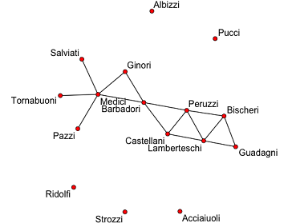

### Introduction to statnetWeb

statnetWeb is a prototype web interactive interface for social network analysis. The functionality is based on the **ergm** package, a member of the statnet network analysis software suite, and also incorporates functionality from the associated packages **network** and **sna**.

To learn more about statnet, see the [statnet Wiki](https://statnet.csde.washington.edu/trac), where you can find publications, tutorials and recent news.

This document is meant to serve as a manual for the functionality of statnetWeb and as a guide to using the app as a teaching tool for introductory network analysis. After the two introductory sections, each header of the document corresponds to a page in statnetWeb. 

### Introduction to Network Analysis

In the network depiction of a community, nodes represent individual entities (people, organizations, etc.), which may be connected to each other by edges. The type of network will vary depending on the community it depicts. 

* Edges can be directed/undirected and valued/binary
* Nodes can have categorical or quantitative attributes associated

$\rightarrow$ Networks can be: directed, valued, bipartite, etc.

By analyzing a social network, we can gain insight to the underlying structure of the network and how that structure influences the individual actors and relationships in the network.

### statnetWeb: Data

Outside of statnetWeb, the nodes and edges of a network can be denoted by adjacency matrices, incidence matrices or edge lists. Below is the adjacency matrix from the Florentine business network.

Observed network data can be uploaded to statnetWeb in various formats. From the Upload Network tab, the user can transfer files saved in Excel, R or Pajek into statnetWeb for further analysis.  

<ul>
<li>**Excel:** 
  <ul>
  <li>Specify the type of matrix and upload a .csv file of relational data. </li>
  <li>Adjacency matrices should have vertex labels in the first row and column.</li>
  <li>Incidence matrices should have edge labels in the first row and vertex labels in the first column.</li>
  <li>Edge lists should not have row or column labels.</li>
  </ul>
</li>
<li>**R:** 
  <ul>
  <li>Upload a matrix of relational data or a statnet network object. </li>
  <li>Objects should be exported from R using the command `save(objectname, file="newfilename"  )`.  
  By default the file will be saved into the current working directory, but the full path to a new location can be specified in the `file=` argument, or set `file=file.choose(new=TRUE)` to use a save dialog box.</li>
  </ul>
</li>
<li>**Pajek:** 
  <ul>
  <li>Upload network or project files (.net or .paj, respectively). </li>
  </ul>
</li>
</ul>  

Alternatively, the user can choose from pre-loaded sample networks to experiment with while becoming familiar with statnetWeb.

### statnetWeb: Network Descriptives

Network descriptives are valuable for gaining insight into the observed network. Exploring plots and descriptive statistics before fitting a model can lead to better model formulations and improve interpretation of results.  

### statnetWeb: Fit Model

Our goal is to use key model statistics to fit an exponential-family random graph model (ERGM) to the observed data. We want this model to capture the underlying structure of the network.  

What is an ERGM?  

* Exponential-family random graph models: a class of models for specifying the probability distribution for a set of random graphs or networks.
$$ P(Y=y)=\frac{exp(\theta)}{k(\theta)} $$

### statnetWeb: MCMC Diagnostics

### statnetWeb: Goodness-of-fit

### statnetWeb: Simulations

  
 
