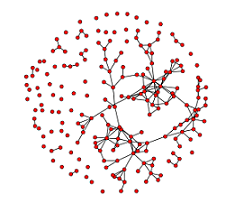
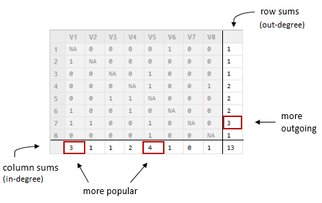
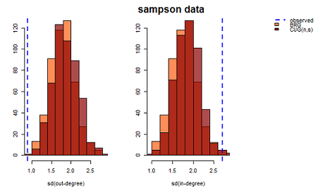
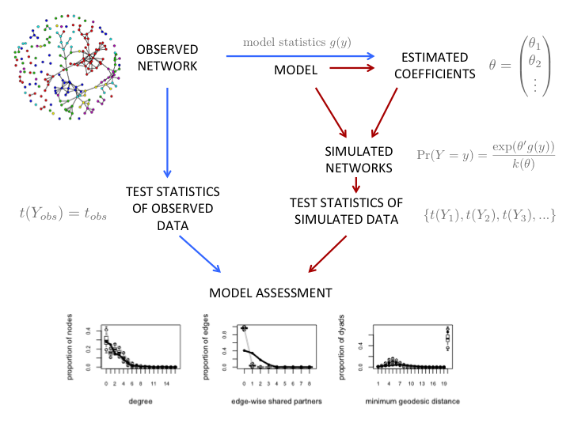

# Introduction to statnetWeb

statnetWeb is a prototype web interactive application for social network analysis. Users can perform complete analyses of relational data (including network visualization, model estimation and evaluation, and model-based simulation) through the user-friendly interface and can download results and figures throughout the process. 

This document is meant to serve as a guide to using statnetWeb as a teaching tool for introductory network analysis courses. Below we provide a course outline template with references to in-depth resources for certain topics. Following the course template is a brief summary of the programming involved in creating statnetWeb.

Suggestions for improvements and additional functionality to statnetWeb are welcome!

## Why These Tools?

Network analysis techniques have progressed immensely over the past 60 years and continue to develop quickly. 
<ul>
<li> Graph theoretic summaries
  <ul>
  <li>Degree distribution, geodesics, centrality measures, etc.
  <li>No inference
  </ul>
<li> Conditionally uniform models (Holland and Leinhardt 1976, Wasserman 1977)
  <ul>
  <li>Useful as null hypotheses, but don't give indications of how to model
  </ul>
<li> $p_1$ model ([Holland and Leinhardt 1981](http://www.stat.cmu.edu/~fienberg/Stat36-835/HollandLeinhardt-JASA-1981.pdf))
  <ul>
  <li>Statistical inference
  <li>Large number of parameters
  </ul>
<li> Markov model
  <ul>
  <li>Dyad dependence
  </ul>
<li> ERGMs
</ul>


As the field grows, software programs geared toward various types of network analysis (above) are created. A dichotomy has emerged between those accessed with a graphical user interface and those accessed through the command line. Although GUI-based programs are easier for a wide range of people to interact with, the analysis possibilities are limited to the specific options provided in the interface. On the other hand, command line interfaces allow the user much more flexibility, but require a significant initial investment to learn the syntax of a programming language.

The [statnet](https://statnet.csde.washington.edu/trac) project encompasses a suite of packages in the R programming language and provides a comprehensive framework for statistical network modeling based on exponential family random graph models. 
Learning how to program in R before accessing these powerful statistical analysis tools presents a large barrier to many people who are new to network analysis, so we created statnetWeb in order to reduce the upfront obstacles.

The functionality of statnetWeb is based on the **ergm** package, a member of the statnet software suite, and also incorporates the associated packages **network** and **sna**. The app occupies a middle ground in the spectrum of software accessibility and we see it as a valuable tool for teaching and understanding the concepts and process of network analysis in a context less dependent on programming expertise. For in depth analysis, researchers can transition into accessing the full functionality of statnet through the command line. 

statnetWeb is built with [Shiny](http://shiny.rstudio.com/), a framework for creating web applications with content written in R.  The app is available online at https://ebey.shinyapps.io/statnetWeb/ or can be run locally through RStudio. Development is on [GitHub](https://github.com/statnet/statnetWeb), where anyone can browse the code, make suggestions and report issues. 

To learn more about statnet, see the [statnet Wiki](https://statnet.csde.washington.edu/trac), where you can find publications, tutorials and recent news.

# Course Material

## Basic Components of Network Analysis

<font class="lobj">Learning objectives:</font> Know what a network is, what it can represent and why we use it. Gain a broad sense of network analysis uses and methods.

**What is a network?** A population of nodes with links.
<ul>
<li>*Nodes:* aka vertices, actors</li>
  <ul>
  <li>Represent individual entities (people, organizations, etc.), which may be connected to each other by *links*.</li>
  <li>Nodes can have associated categorical or quantitative attributes (age, sex, etc.).</li>
  </ul>
<li>*Links:* aka edges, ties</li>
  <ul>
  <li>Can be directed/undirected and valued/binary</li>
  </ul>
<li>Types of networks: bipartite, valued, directed, etc.</li>
  <ul>
  <li>Defined by properties of the nodes and links</li>
  </ul>
</ul>


**Motivation**  
What can we accomplish with network analysis?  
<ul>
<li>Examples</li>
  <ul>
  <li>Show examples with statnetWeb</li>
  </ul>
<li>Glimpse ahead to types of analysis</li>
</ul>

**Network data storage and representation**
<ul>
<li>Overview of adjacency matrices, incidence matrices, edge lists</li>
</ul>
**Network data as a graph**
<ul>
<li>Graph notation</li>
<li>Graph terminology</li>
</ul>

**Network data sampling designs**
<ul>
<li>Census: data on every node and link in the population of interest</li>
<li>Adaptive sample: link-tracing designs, e.g., snowballs, respondent-driven sampling, etc.</li>
<li>Egocentric sample: a sample of nodes (egos) with data on their links to other nodes (alters).  The alters may or may not be identifiable, and may or may not be in the sample, and data may or may not exist on ties between the alters (as reported by ego).</li>
</ul>
**Types of statistical network analysis**  
See [Snijders 2011](http://www.stats.ox.ac.uk/~snijders/StatModelsSocNetworks.pdf)
<ul>
<li>Descriptive</li>
  <ul>
  <li>A set of summary statistics calculated on the network</li>
  <ul>
  <li>E.g., density, degree distribution, centrality, etc.</li>
  </ul>
  </ul>
<li>Statistical</li>
  <ul>
  <li>If the researcher can capture the underlying structural features of a network with a few parameters, they can gain insight to how that structure influences the individual actors and relationships in the network and predict the structure of other networks.
  <li>The researcher creates a model, assumes that the observed network is the outcome of a random draw from that model.
  <ul>
  <li>A model represents the factors that determine the probability of a link between two nodes, with parameters that can be estimated from network data.</li>
  </ul>
  <li>Models for links, nodal attributes fixed:</li>
  <ul>
  <li>In simple random graphs, each edge between two nodes is equally likely - not the case for most social networks</li>
  <ul>
  <li>The chance of a tie between nodes i and j may depend on the attributes of i and j (e.g. Homophily)</li>
  </ul>
  </ul>
  <li>Joint models for nodal attributes and links:  Influence and Selection</li>
  <ul>
  <li>Transitivity
  </ul>
  </ul>
</ul>

<font class="ex">Exercise:</font> Read introductory chapters of a social network analysis textbook. Read published network analysis paper and identify type of analysis and why it was used.

## Network Data

<font class="lobj">Learning objectives:</font> Know differences between network representation methods and advantages/disadvantages of each. Practice creating networks, translating between each representation and uploading to statnetWeb.

Outside of statnetWeb, the nodes and edges of a network can be denoted by adjacency matrices, incidence matrices or edge lists.


<ul>
<li>Limitations:
  <ul>
  <li>Adjacency matrices are large, but often sparse
  <li>Edge lists don't include isolates
  <li>
  </ul>
<li>The network type will be reflected in the data
</ul>


#### statnetWeb: Data

Observed network data can be uploaded to statnetWeb in various formats. From the Upload Network tab, the user can transfer files saved in Excel, R or Pajek into statnetWeb for further analysis.  


<ul>
<li>**Excel:** </li>
  <ul>
  <li>Specify the type of matrix and upload a .csv file of relational data. </li>
  <li>Adjacency matrices should have vertex labels in the first row and column.</li>
  <li>Incidence matrices should have edge labels in the first row and vertex labels in the first column.</li>
  <li>Edge lists should not have row or column labels.</li>
  </ul>
<li>**R:** </li>
  <ul>
  <li>Upload a matrix of relational data or a statnet network object. </li>
  <li>Objects should be exported from R using the command `save(objectname, file="newfilename"  )`.  
  By default the file will be saved into the current working directory, but the full path to a new location can be specified in the `file=` argument, or set `file=file.choose(new=TRUE)` to use a save dialog box.</li>
  </ul>
<li>**Pajek:** </li>
  <ul>
  <li>Upload network or project files (.net or .paj, respectively). </li>
  </ul>
</ul>  


Alternatively, the user can choose from pre-loaded sample networks to experiment with while becoming familiar with statnetWeb.

Once a network has been uploaded, a summary of the network's properties will be displayed on the right side of the page.

 

**Missing Data**
<ul>
<li>Missing edge $\not\Rightarrow$ no edge</li>
<li>statnet interprets NA entries not along the diagonal as missing
</ul>

<font class="ex">Exercise:</font> Practice creating networks, translating between each representation and uploading to statnetWeb.

## Network Descriptives

<font class="lobj">Learning objectives:</font>

Network descriptives are valuable for gaining insight into the observed network. Exploring plots and descriptive statistics before fitting a model can lead to better model formulations and improve interpretation of results.  


#### statnetWeb: Network Descriptives

**Network Plot**  
Looking at a network plot can give a general sense of the network, and editing the display options is even more revealing. When the nodes of the `faux.mesa.high` network are color-coded, it is easy to see clustering by grade. Likewise, sizing the nodes of the flomarriage by wealth shows a tendency for wealthier families to have more marriage ties.

In statnetWeb, any nodal attributes will be available in the color-coding menu. Numeric attributes, plus the betweenness measures of the nodes will be available in the sizing menu.

 


**Degree Distribution**  
Inspect the distribution of nodal degrees throughout the network. Do most nodes have similar degree? Are there a few nodes with high degree ("hubs") and many with low degree? Does the distribution vary by attribute? 


Null models: 
<ul>
<li>Conditional uniform graphs (CUG): Draws from the distribution of simple random graphs with the same fixed density as the observed network.</li>
<li>Bernoulli random graphs (BRG): Draws from the distribution of simple random graphs with the same stochastic tie probability as the observed network.</li>
</ul>  

<font class="ex">Exercise:</font> What is different about the null models? Are there situations when one would be more important than the other? How does the observed network compare to the null models and what does that tell us?


**Geodesic Distribution**  
The geodesic measures the length of the shortest path between two nodes. A geodesic distance of "inf" between two nodes means that they are not connected by any path. Compare the distribution of the geodesics from all the dyads in the observed network to null models.

**More**
<ul>
<li>Mixing matrices</li>
<li>Node-level indices</li>
  <ul>
  <li>Degree, Betweenness, Closeness, Stress Centrality, Graph Centrality, Eigenvector Centrality, Information Centrality
  </ul>
<li>Graph-level indices</li>
  <ul>
  <li>Reciprocity, Transitivity, Density, Degree, Betweenness, Closeness, etc.
  </ul>
</ul>

## Statistical Models

<font class="lobj">Learning objectives:</font> Build understanding of modeling process step by step, eventually arriving at ERGMs.

The appropriate model depends on the type of data. For now, we consider fully observed binary networks.

Recall, we want to capture the underlying structural features of a network with a few parameters.


**Conditionally uniform models**
  <ul>
  <li>Useful as null models for hypothesis testing - we can compare test statistics from the observed network to the distribution of these statistics under the null models. If the observed value of the test statistic is sufficiently different from the null distribution we can reject the hypothesis that the observed network was generated by the null model.
  <li>BRG($\rho$): Bernoulli random graphs (simple random graphs)
  <ul>
  <li>All possible graphs where the probability of each tie is a constant $\rho$ (number of nodes $n$ is taken from observed network).
  <li>Which $\rho$ to use if we want to reject all bernoulli graphs? If we use a value $\hat\rho$ that maximizes the probability that our observed network $y$ came from the distribution BRG($\rho$) and can reject this model, then we can reject BRG($\rho$) for all $\rho$. It can be shown that the MLE $\hat\rho$ is equal to $\bar{y}$, the density of the observed network.
  </ul>
  <li>CUG($s$): All possible graphs conditional on number of ties $s$ (Erdos-Reyni graphs)
  <ul>
  <li>CUG($s$) does not require that we estimate $\rho$, it always reproduces the density of the observed network. It often gives similar results to the BRG($\hat\rho$) model above. 
  </ul>
  <div class="ex">
  <font class="ex">Example:</font> Compare the observed density of the `faux.mesa.high` network to the distribution of densities obtained from BRG($\hat\rho$). Note that when testing the standard-deviation of degrees in the network, the null models have similar distributions, but both fail to recreate the level of heterogeneity seen in the observed network.
  <div align="center">  </div>
  Also see these distributions as overlays on the degree and geodesic distributions in **statnetWeb**.  
  When compared to the null models, the `faux.mesa.high` network has fewer paths of length 5-8 than we would expect, and more disconnected node pairs (with geodesic distance inf).  
<div align="center"> </div>
  </div>
  <li>We can add more conditions to the model: 
  <ul>
  <li>A null hypothesis where ties are independent of covariates, i.e. $p(Y,x)=p(Y) \times p(x)$, and the ties are drawn from the CUG($s$) distribution. We can simulate this by randomly reassigning the ties in $Y$ and holding the covariates $x$ constant.  
```
Ysim <- matrix(0,n,n)
diag(Ysim) <- NA
Ysim[!is.na(Ysim)] <- sample(Yobs[!is.na(Yobs)])
```
  <li>A null hypothesis where ties are independent of covariates and  the covariates are i.i.d. for some distribution $p(x)$. We can simulate this by holding the ties in $Y$ constant and randomly permuting the values in $x$.
```
Ysim <- Yobs
xsim <- sample(xobs)
```
  </ul>
  </ul>
  
**Covariate effects, odds ratios for tie preferences**
  <ul>
  <li>Rearrange the rows and columns of an adjacency matrix to create a blockmodel where nodes are grouped by values of a nodal covariate. Each block is a subgraph with its own density.
  <li>Comparing densities of the blocks shows potential effects from the covariate on tie formation.
  
  
  
  <li> The odds of an event $E$ occurring is the ratio of the probability that $E$ occurs to the probability that it doesn't.  
  $\text{odds}(E) = \frac{\text{Pr}(E)}{1-\text{Pr}(E)}$
  <li> An odds ratio compares the odds of $E$ occuring given $A$, to the odds of $E$ occuring given $B$, where $B=A^C$    
  $\text{odds}(E| A, B) = \frac{\text{Pr}(E|A)}{1-\text{Pr}(E|A)}\frac{1-\text{Pr}(E|B)}{\text{Pr}(E|B)}$
  <li> The relative rates $\frac{p_{01}}{p_{00}}, \frac{p_{10}}{p_{00}}$ capture the relative tendency of ties in heterogeneous pairs compared to the baseline rate $p_{00}$
  <li> The odds ratio $\frac{p_{00}p_{11}}{p_{01}p_{10}} = \gamma$ represents preference for homophily.
  <ul>
  <li> $\gamma = \text{odds ratio}(x_j=1 | \{y_{ij}=1,x_i=1\}\{y_{ij},x_i=0\})$
  <li> $\gamma = \text{odds ratio}(x_i=1 | \{y_{ij}=1,x_j=1\}\{y_{ij},x_j=0\})$
  </ul>
  <li> Together, the set $\{ p_{00}, \frac{p_{01}}{p_{00}}, \frac{p_{10}}{p_{00}}, \frac{p_{00}p_{11}}{p_{01}p_{10}}\}$ can give a better sense of the data than individual probabilities from each block.
  
  <div class="ex">
  <font class="ex">Example:</font> Ties between males/females in `faux.mesa.high` network. We can see from the probabilities of ties within and between the sexes (which are the densities of those subgraphs) that female-female ties are the most likely in this network. The relative rates show us that male-female relationships are less than half as likely as female-female and the odds ratio shows that there is a strong preference for within sex ties.  
  $$\begin{align*}
  p_{FF}&=0.0167 \\
  p_{FM}=p_{MF}&= 0.0068 \\
  p_{MM}&=0.0089
  \end{align*}$$
   
  $$\begin{align*}
  p_{FF}&=0.0167 \\
  \frac{p_{FM}}{p_{FF}}=\frac{p_{MF}}{p_{FF}}&=0.4043 \\
  \frac{p_{FF}p_{MM}}{p_{FM}p_{MF}}&=3.2533
  \end{align*}$$
  </div>
  </ul>
  
**Logistic regression**  
Given a binary outcome variable $y$ and an explanatory variable $x$, we can express the probability of a success ($y=1$) in terms of the logistic function. We can also express the log odds of a success with the logit function. 

$$\begin{align*}
\Pr(y=1) &= \frac{e^x}{1+ e^x} = p \\
\text{odds}(y=1) &= \frac{p}{1-p} \\
\text{logit}(p) &= \log\left(\frac{p}{1-p}\right),  \hspace{2em} 0 < p < 1
\end{align*}$$

Note that the logit function is the inverse of the logistic function.
$$
\text{logit}(p) = \log\left(\frac{p}{1-p}\right) = \log\left(\frac{e^x / (1+e^x)}{1/ (1+e^x)}\right) = \log(e^x) = x
$$

The logit also makes it convenient to write log odds ratios.
$$
\log\left(\frac{p_1/(1-p_1)}{p_2/(1-p_2)}\right) = \log\left(\frac{p_1}{1-p_1}\right) - \log\left(\frac{p_2}{1-p_2}\right) = \text{logit}(p_1) - \text{logit}(p_2)
$$

Given differences between densities in the blockmodel, perhaps we think that the values of a nodal attribute are primary factors in tie formation. We can use logistic regression to model the effect of a binary covariate on the likelihood of ties, assuming that ties form independently of each other:
  <ul>
$$\begin{align*}
 \Pr( y_{i,j} = 1 | x_i,x_j ) &= 
\frac{ e^{ \beta_0 + \beta_1 x_i + \beta_2 x_j +    \beta_{12} x_i x_j}    }
      {1+ e^{ \beta_0 + \beta_1 x_i + \beta_2 x_j +     \beta_{12} x_i x_j }  } \\ \\
\Pr( y_{i,j} = 0 | x_i,x_j ) &= 
\frac{1}{1+e^{\beta_0+\beta_1 x_i + \beta_2 x_j +  \beta_{12} x_i x_j } } \\ \\
\frac{\Pr( y_{i,j} = 1 | x_i,x_j )}{\Pr( y_{i,j} = 0 | x_i,x_j )} = \text{odds}( y_{i,j} = 1 | x_i,x_j ) &= 
  \exp( \beta_0+\beta_1 x_i + \beta_2 x_j +  \beta_{12} x_i x_j ) \\ \\
\text{logit}(y_{i,j} = 1 | x_i,x_j) = \text{log odds}( y_{i,j} = 1 | x_i,x_j ) &= 
  \beta_0+\beta_1 x_i + \beta_2 x_j +  \beta_{12} x_i x_j  
\end{align*}$$
  <li> $\beta_0$ is the baseline log odds of a tie in the case where $x_i = x_j = 0$
  <li> $\beta_1$ is the log of the odds ratio $(y=1|(1,0),(0,0))$, it represents the "effect" of $x_i$
  <li> $\beta_2$ is the log of the odds ratio $(y=1|(0,1),(0,0))$, it represents the "effect" of $x_j$
  <li> $\beta_{12}$ is the log of the ratio of odds ratios $(y=1|(1,1),(0,1))/(y=1|(1,0),(0,0))$, it represents the effect of the interaction $x_i x_j$
  <li>How are $\{\beta_0, \beta_1, \beta_2, \beta_{12}\}$ related to $\{p_{00}, \frac{p_{10}}{p_{00}}, \frac{p_{01}}{p_{00}}, \frac{p_{00}p_{11}}{p_{01}p_{10}}\}$?  
  <ul>
  If network density is low, $1-p_{x_ix_j} \approx 1$  
  $$o_{x_ix_j} = p_{x_ix_j}/(1-p_{x_ix_j}) \approx p_{x_ix_j}$$
  And
  $$\begin{align*}
  \{ p_{00}, \frac{p_{10}}{p_{00}}, \frac{p_{01}}{p_{00}}, \frac{p_{00}p_{11}}{p_{01}p_{10}}\} & \approx \{o_{00}, \frac{o_{10}}{o_{00}}, \frac{o_{01}}{o_{00}}, \frac{o_{00}o_{11}}{o_{01}o_{10}}\} \\
  & = \{\text{e}^{\beta_0}, \text{e}^{\beta_1}, \text{e}^{\beta_2}, \text{e}^{\beta_{12}}\}
  \end{align*}$$
  </ul>
  <div class="ex">
  <font class="ex">Example:</font> Compare these odds ratios from `faux.mesa.high` to the relative rates above. The $\beta$ coefficients were obtained from `glm(y ~ xr + xc + xr*xc, family=binomial)` in R.
  $$\begin{align*}
  \text{exp}(\beta_0) &= 0.0170 \\
  \text{exp}(\beta_1) = \text{exp}(\beta_2) &= 0.4003 \\
  \text{exp}(\beta_{12}) &= 3.2934
  \end{align*}$$
  
  Simulate networks from this model and evaluate the fit based on test statistics:  
  <font class="ex">insert image</font>
  </div>
  </ul>
  
**Individual effects**

Perhaps some nodes in a directed network are more likely to send ties (more sociable) or more likely to receive ties (more popular). We can capture the variability of out-degree and in-degree by fitting the marginal totals of a network's adjacency matrix.
<div align="center">

</div>

The model below takes into account a row effect $a$ from the sender and column effect $b$ from the receiver. Note that in an undirected network the row and column sums are equal, so $a_i = b_i$ for each node $i$.

  <ul>
  $$\text{Pr}(Y_{ij}=1)=\frac{\text{e}^{\mu + a_{i} + b_{j}}}{1+\text{e}^{\mu + a_{i} + b_{j}}}$$   
  
  <div style="position:relative; left:200px;">
  $\mu$: grand mean  
  $a_i$: measure of sociability of node i  
  $b_j$: measure of popularity of node j
  </div>
  
  <div class="ex">
  <font class="ex">Example:</font> Consider a directed network of friendship nominations among a group of monks. Clearly our previous null models do not accurately capture the heterogeneity of in- and out-degree.  
  <div align="center">  </div>  
  **RCE model:**
  <font class="ex">insert image</font>
  </div>
  </ul>
  

<ul> 
<li>$p_1$ model
<li>$p_2$ model
</ul>

**Exponential random graph models ($p^*$)**
  <ul>
  <li>
  </ul>


### ERG Model Specification



**What is an ERGM?**  
Exponential-family random graph models are a class of models for specifying the probability distribution for a set of random graphs or networks.
$$ P(Y=y)=\frac{\mathrm{exp}(\theta'g(y))}{k(\theta)} $$
<ul>
<li> $Y$: random variable for state of network (with realization $y$)
<li> $g(y)$: vector of model statistics for network $y$
<li> $\theta$: vector of coefficients for statistics $g(y)$
<li> $k(\theta)$: numerator summed over all possible networks (with same node set as $y$)
</ul>

Conditional log-odds: $\mathrm{logit}(Y_{ij} = 1|y_{ij}^{c}) = \theta'\delta(y_{ij})$
<ul>
<li>$\delta(y_{ij})$ is the change statistic, i.e. it records how $g(y)$ changes if the tie $y_{ij}$ is toggled on or off</li>
<li>$\theta$ (the coefficient for a model statistic) is the log-odds of an individual tie conditional on all others</li>
</ul>

Our goal is to use key model statistics to fit an exponential-family random graph model (ERGM) to the observed data. We want this model to capture the underlying structure of the network, so we include statistics that we hypothesize differ significantly in the observed network when compared to a simple random graph.  

<u>Important to consider:</u> model statistics are either dyad dependent or dyad independent.

* edges
* triangles
* nodes of degree 0
* nodal homophily (nodematch)

<font class="ex">Exercise:</font> Which of the above terms are dyad dependent? Why?

### ERGM Estimation

#### statnetWeb: Fit Model

We can choose which model statistics to include in an ERGM. In statnetWeb, each model statistic that we want to include is represented by a term in the model formula. There are many terms coded into the statnet software and the term documentation window in statnetWeb gives access to the help file of each one.
<ul>
<li>Browse through all terms or narrow the results down to only the terms that are applicable to the currently loaded network.
<li>Commonly used terms: [click here](statnet.csde.washington.edu/EpiModel/nme/2014/d2-ergmterms.html)
</ul>

How does statnetWeb find a model that fits?  
<ul>
<li>MLE: maximum likelihood estimation</li>
<li>MCMC: only for models with dyadic dependent terms</li>
</ul>

Output from model fitting
<ul>
<li>Iterations - useful to see if model is degenerate</li>
<li>Model summary</li>
  <ul>
  <li>Interpretation of coefficient estimates:</li>
  <ul>
  <li>Conditional log-odds of two actors having a tie is  
  $\theta_1$ x change in stat1 + $\theta_2$ x change in stat2
  <li>Corresponding probability from equation above
  </ul>
  </ul>
  <li>Save up to five models for comparison  
  
</ul>

<font class="ex">Example: Bernoulli model</font> 
<ul><li>flomarriage ~ edges</li></ul>

<font class="ex">Example: Triad formation</font>  
<ul><li>flomarriage ~ edges + triangle</li></ul>

<font class="ex">Example: Nodal covariates</font>  
<ul><li>flomarriage ~ edges + nodecov("wealth")</li></ul>

<font class="ex">Example: -Inf coefficients</font>  

<font class="ex">Example: Missing data in ERGMs</font>
<ul>
<li>missnet ~ edges
<li>Compare when edges are coded as missing vs. zeros
</ul>


When a model fails
<ul>
<li>Control parameters: burn-in, interval, sample size
<li>If the user is familiar with more MCMC control parameters, they can be entered in the text box.
</ul>

## Model Evaluation

<font class="lobj">Learning objectives:</font>

Recall the hypothesis testing with conditionally uniform models. If we reject a single model, for example a simple random graph with tie probability $\theta_1$, we cannot necessarily reject any other simple random graph with $\theta_2$. Instead of checking every possible value of $\theta$, we use the maximum likelihood estimator $\hat\theta$ so that $p(Y|\hat\theta) \ge p(Y|\theta)$ for all $\theta \in \Theta$.

#### statnetWeb: MCMC Diagnostics

We want the MCMC sample statistics to vary randomly around the observed values and the difference between the observed and simulated values of the sample statistics to have a roughly bell-shaped distribution, centered at 0.  
<ul>
<li>flobusiness ~ edges+degree(1)  

</ul>
Interpreting other MCMC diagnostics  
<ul>
<li>flobusiness ~ edges+degree(0)  
flobusiness has 5 isolates, can't have any fewer than -5 from target statistic  
try to modify control parameters and do better

</ul>

#### statnetWeb: Goodness-of-fit

Test how well your model fits the original data by choosing a network statistic that is not in the model, and comparing the value of this statistic observed in the original network to the distribution of values you get in simulated networks from your model.  
When multiple models are saved, compare GOF plots in a chart.

## Model-Based Simulation

<font class="lobj">Learning objectives:</font>

After creating an ergm and checking the diagnostics, we can simulate from it (take examples of networks drawn from this distribution). If the model is a good fit to the observed data, then networks drawn from this distribution will be more likely to “resemble” the observed data.

#### statnetWeb: Simulate

<ul>
<li>View network plot of each simulation; edit display options in the same way as the plot of the observed network.
<li>View plot of simulation statistics compared to the target statistics
[IMAGE OF AUTOCORRELATED STATISTICS]
<li>Edit MCMC controls (e.g. increase the interval if simulation statistics are highly auto-correlated.)
[IMAGE AFTER INCREASING INTERVAL]
<li>Download simulation statistics
</ul>

## Review and Further Topics

<font class="lobj">Learning objectives:</font>

Longitudinal network analysis?

## Course Outlines

**10 Week Course:**

* Network analysis basics: 2 weeks
* Data: 1 week
* Network descriptives: 1 week
* Statistical models: 2 weeks
* Diagnostics: 1 week
* Model-based simulation: 2 weeks
* Review and further topics: 1 week

**14 Week Course:**

* Network analysis basics: 2 weeks
* Data: 1 week
* Network descriptives: 2 week
* Statistical models: 3 weeks
* Diagnostics: 1 week
* Model-based simulation: 2 weeks
* Review and further topics: 3 weeks

# Shiny

The code for statnetWeb is publicly available at our [GitHub repository](https://github.com/statnet/statnetWeb)

  
 
